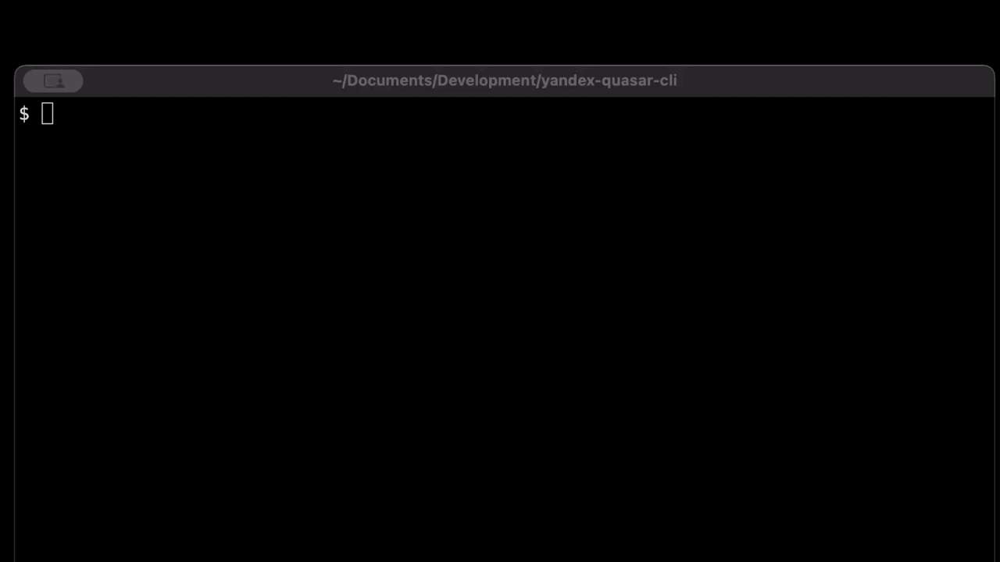

# yandex-quasar-cli

[](https://pypi.org/project/quasar-cli/)
[](https://github.com/p1ne/quasar-cli/releases)
[](https://github.com/p1ne/quasar-cli/actions/workflows/test.yml)
[](https://github.com/p1ne/quasar-cli/blob/master/LICENSE)

Интерфейс командной строки для Yandex Smart Home API

/ Далее по тексту - УДЯ - Умный Дом Яндекса /

Утилита работает с УДЯ через командную строку, конечная цель - уметь то же, что умеет Web-интерфейс Яндекс Quasar

Сейчас она умеет
 - выводить информацию о сущностях УДЯ (устройствах, комнатах, ... ) в текстовом или TSV форматах
 - выводить информацию об отдельно взятом устройстве
 - удалять устройство по его ID
 - включать/выключать устройства, имеющие capability "выключатель"
 - сохранять снапшот - слепок информации о текущем состоянии сущностей УДЯ
 - сравнивать текущее состояние сущностей УДЯ с сохраненным снапшотом и выводить сравнение в разных форматах
   - полное сравнение
   - сравнение за исключением изменений в properties и capabilities
   - краткая форма со списком удаленных и добавленных устройств

Работа со снапшотами и вывод в краткой форме удобен для формирования списков include_entities/exclude_entites расширения
Home Assistant [yandex_smart_home](https://github.com/dext0r/yandex_smart_home)

Утилита находится на ранних этапах развития, и точно содержит ошибки и недоработки, багрепорты и пулл реквесты
приветствуются



## Установка

Для установки воспользуйтесь `pip`:

    pip install yandex-quasar-cli

## Использование

Для запуска используйте либо прямой вызов команды:

    yandex-quasar-cli --help

Либо запуск через модуль:

    python -m yandex_quasar_cli --help

### Команды верхнего уровня

| Команда                                       | Что делает                                  |
|-----------------------------------------------|---------------------------------------------|
| ```yandex-quasar-cli quasar```                | Получение общей информации о сущностях УДЯ  |
| ```yandex-quasar-cli device```                | Работа с отдельным устройством  |
| ```yandex-quasar-cli oauth```                 | Работа с ключом OAuth  |
| ```yandex-quasar-cli snapshots```             | Работа со снапшотами состояния  |

### ```oauth```: работа с ключом OAuth

Ключ OAuth обязателен для получения доступа к УДЯ через API Яндекса. Все команды утилиты, кроме help и собственно oauth
требуют валидного ключа

Команды:

| Команда                                       | Что делает                                                |
|-----------------------------------------------|-----------------------------------------------------------|
| ```oauth help```                              | Вывод справки о том, как получить OAuth ключ к своему УДЯ |
| ```oauth save-key <key>```  | Сохранить OAuth ключ в конфигурационном файле             |
| ```oauth print-key <key>``` | Вывести ранее сохраненный OAuth ключ в консоль            |

### ```quasar```: получение информации о сущностях УДЯ

Выводит информацию о сущностях УДЯ в текстовом или табличном TSV формате

#### Команды:

| Команда                    | Что делает                              |
|----------------------------|-----------------------------------------|
| ```quasar <object-type>``` | Общий формат команды                    |
| ```quasar devices```       | Информация об устройствах               |
| ```quasar groups```        | Информация о группах                    |
| ```quasar households```    | Информация о домах                      |
| ```quasar rooms```         | Информация о комнатах                   |
| ```quasar scenarios```     | Информация о сценариях                  |

#### Опции:

```--tsv``` Вывод информации в табличном TSV формате

| Команда                    | Что делает                              |
|----------------------------|-----------------------------------------|
| ```quasar devices --tsv``` | Информация об устройствах в формате TSV |

### ```devices```: работа с устройством УДЯ

Выводит информацию об устройствах или дает управлять ими
Устройство идентифицируется при помощи <id> устройства в УДЯ вида ece1632c-0e22-42ba-bbef-1c7ff107bd29. 
Id может быть получен командой ```quasar devices```

#### Команды:

| Команда                      | Что делает                                                                 |
|------------------------------|----------------------------------------------------------------------------|
| ```device info <id>```       | Информация об устройстве с указанным id                                    |
| ```device delete <id>```     | Удаление устройства с указанным id                                         |
| ```device switch-on <id>```  | Включение устройства с указанным id, если оно работает как выключатель     |
| ```device switch-off <id>``` | Выключение устройства с указанным id, если оно работает как выключатель    |

#### Опции:

```--tsv``` Вывод информации в табличном TSV формате
```--ext``` (только для команды delete) - используется external id в качестве аргумента удаления

| Команда                 | Что делает                              |
|-------------------------|-----------------------------------------|
| ```device <id> --tsv``` | Информация об устройствах в формате TSV |

### ```snapshot```: работа со слепками состояния УДЯ

Позволяет сохранять состояние всех сущностей УДЯ на текущий момент времени в конфигурационном файле и позже сравнивать
новое состояние сущностей УДЯ с сохраненным. Удобно для отладки, а также для генерации списков устройств для 
Home Assistant
Вывод либо имеет структуру, похожую на JSON формат Yandex API, либо перечисляет добавленные или удаленные сущности

#### Команды:

| Команда                      | Что делает                                                                 |
|------------------------------|----------------------------------------------------------------------------|
| ```snapshot save```          | Сохранение слепка текущего состояния УДЯ. Предыдущий слепок перезатирается |
| ```snapshot compare```       | Сравнение текущего состояния УДЯ с сохраненным слепком                     |

#### Опции команды ```snapshot compare```:

| Команда                      | Что делает                                                                                 |
|------------------------------|--------------------------------------------------------------------------------------------|
| ```snapshot compare```       | Сравнение текущего состояния УДЯ с сохраненным слепком                                     |
| ```snapshot compare --no-props-caps```      | Сравнение без текущих значений датчиков                                                    |
| ```snapshot compare --full```      | Полное сравнение (выдает только различающиеся поля объектов)                               |
| ```snapshot compare --external-ids```      | Вывод списка external id добавленных и удаленных устройств (с префиксами +/-               |
| ```snapshot compare --ids```       | Вывод списка external id и internal id добавленных и удаленных устройств (с префиксами +/- |

# Помочь с разработкой

Для того, чтобы поучаствовать в разработке, скачайте себе исходный код, после чего настройте окружение venv:

    cd yandex-quasar-cli
    python -m venv venv
    source venv/bin/activate

Установите зависимости:

    pip install -e '.[test]'

Для запуска тестов (пока их нет):

    pytest
